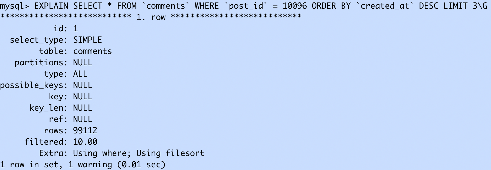

# prtimes_intern

## スコア

### 初期

{"pass":true,"score":1133,"success":988,"fail":0,"messages":[]}


### 変更後

#### 1つ目の変更点
post_id_idx を追加した
##### 変更理由
- SQL により CPU が圧迫されており、一つのクエリでレスポンス時間の 70%を占めている
  
  
  - 該当のクエリでは、97k 行の確認をして、1.4 行の結果を返している
  - → 検査する数を減らせるのではないか

- 原因の SQL を探ったところ、検索効率を上げる index が NULL なため、index を追加することで検索効率が上がる可能性がある
    
    - 変更前の comment table
      
      このテーブルにpost_id_idx を追加した
    - index 追加後の comment table
      
    - comment テーブル変更後の検索に必要な行数が1行に減った
      
##### ここまでの変更でのスコアの変化
    
    `{"pass":true,"score":7881,"success":7030,"fail":0,"messages":[]}`

#### 2つ目の変更点
****make_postsメソッドのSQLクエリを変更した****
- データを全部取得したにも関わらず、使用するのは del_flg が 0 のだけなので、はじめから 0 のデータのみを取得するように変更した
  - ```
    post[:user] = db.prepare('SELECT * FROM `users` WHERE `id` = ? AND `del_flg` = 0').execute(
             post[:user_id]
           ).first
    ```
##### 変更理由
- app の負荷が SQL を超えたため、appの処理を修正することにした
  
  - '/'のアクセスが多い(app.rb)、かつ、'/'の処理の中では get_session と make_posts というメソッドが使用されているが、DB へのアクセスが多かったのが make_posts だったので、こちらのメソッドを修正した
  
##### この変更後のスコア
  
  `{"pass":true,"score":7944,"success":7045,"fail":0,"messages":[]}`

### 不明点

- コードを何も変えていないのに、出力されるスコアが変化した理由
- 

## 参考文献

- **解説記事を参考にした理由**
  - スコアを改善するには、どのような観点からの改善が必要なのかわからなかったから
- **参考記事を読んでわかったこと**
  - 今回の ISCON のインターン用ではチューニングを行ってスコアを上げる
  - チューニングの目的は、大量のアクセス等があった際システムのパフォーマンスが下がるのを防ぐため
  - チューニングの際、最初に行うのは、パフォーマンス低下の原因箇所を探す
- **参考記事**
  - [インターン生向けの ISUCON CM](https://qiita.com/catatsuy/items/2d83783d80157daf4b44)
  - [パフォーマンスチューニングの目的と流れを書いてみた](https://qiita.com/tbtakhk/items/ecf1bc502333d2bdab52)
- [社内で ISUCON 問題(private-isu)に触れてみた](https://note.com/pharmax/n/nf9a163c09554#11620be8-b693-465f-a0c4-157ef42ed8c2)
